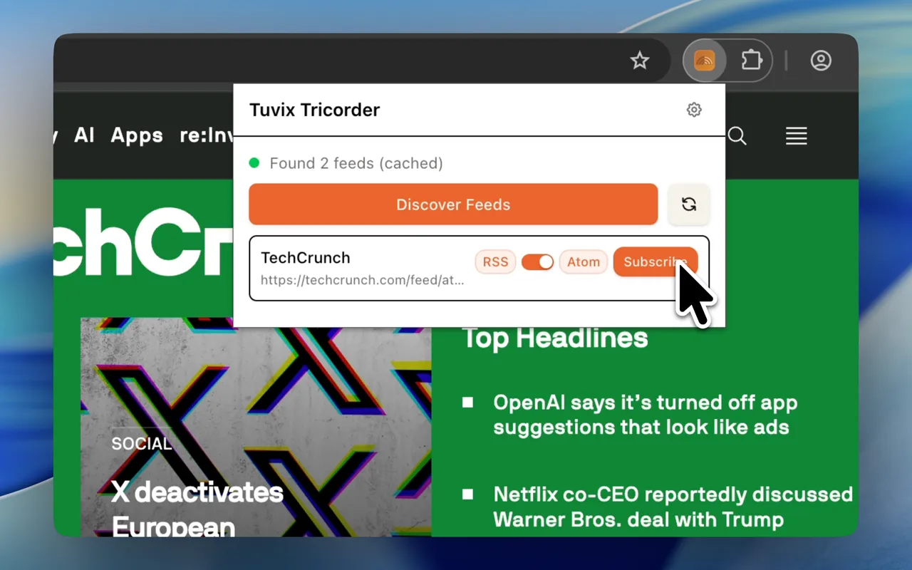

# Tuvix Tricorder Extension

The official companion browser extension for [Tuvix RSS](https://github.com/TechSquidTV/Tuvix-RSS) - a modern, self-hostable RSS aggregator that puts you back in control of your content consumption.

Tuvix Tricorder makes RSS feed discovery effortless. While browsing any website, click the extension icon to instantly discover and access RSS/Atom feeds. Built with the [@tuvixrss/tricorder](https://www.npmjs.com/package/@tuvixrss/tricorder) library, it seamlessly integrates with the Tuvix RSS ecosystem.



## About Tuvix RSS

[Tuvix RSS](https://tuvix.app) is a modern RSS aggregator designed for data ownership and portability. Unlike traditional feed readers that lock you in, Tuvix emphasizes:

- **Self-Hosting**: Deploy on your own infrastructure with Docker Compose or Cloudflare Workers
- **Data Portability**: Full OPML export to migrate to any RSS reader
- **Modern Stack**: TypeScript, tRPC, and PWA-capable
- **User Control**: Escape algorithmic feeds and curate your own content sources

This browser extension extends Tuvix's mission by making feed discovery and subscription a one-click experience.

## Features

- **Automatic Feed Discovery**: Detects RSS, Atom, RDF, and JSON feeds on any webpage
- **Visual Status Icons**: Three states (disabled, searching, discovered)
- **Cross-Browser Support**: Works on Chrome, Firefox, Edge, and Safari
- **Zero Configuration**: Just click and discover
- **Smart Detection**: Handles special cases like Apple Podcasts and common feed locations
- **One-Click Access**: Click any discovered feed to open it in a new tab

## Development

### Prerequisites

- Node.js 18+
- pnpm

### Setup

```bash
pnpm install
```

### Development with Hot Reload

The extension supports hot reload for rapid development:

```bash
# Firefox with auto-reload (recommended)
pnpm dev

# Chrome with auto-reload
pnpm dev:chrome
```

This will:
1. Build the extension in watch mode
2. Launch the browser with the extension loaded
3. Automatically reload the extension when you make changes

**Note**: The first time you run the dev command, web-ext will launch a browser instance. Any changes to `.ts` or `.html` files will automatically trigger a rebuild and reload.

### Manual Build

```bash
# Build for Chrome/Edge (uses service worker)
pnpm build

# Build for Firefox (uses Firefox-specific manifest)
pnpm build:firefox
```

## Loading the Extension

### Chrome/Edge

1. Go to `chrome://extensions/` (or `edge://extensions/`)
2. Enable "Developer mode"
3. Click "Load unpacked"
4. Select the `dist` folder

### Firefox

1. Go to `about:debugging#/runtime/this-firefox`
2. Click "Load Temporary Add-on"
3. Navigate to `dist/` folder
4. Select `manifest.json`

### Safari

Safari requires additional steps and Apple Developer account. See [Safari Extension Documentation](https://developer.apple.com/documentation/safariservices/safari_web_extensions).

## Usage

1. Navigate to any website
2. Click the Tuvix Tricorder extension icon
3. Click "Discover Feeds" button
4. View discovered feeds and click to open in new tab

## Icon States

- **Disabled** (gray): Default state, ready to scan
- **Enabled** (yellow, animated): Actively searching for feeds
- **Discovered** (green): Feeds found successfully

## Cross-Browser Compatibility

This extension follows MDN's best practices for cross-browser extensions:

- Uses `webextension-polyfill` for API compatibility
- Separate manifests for Chrome (service worker) and Firefox (background scripts)
- Promises-based API for all async operations
- Minimum browser versions:
  - Chrome/Edge: 109+
  - Firefox: 109+

## Project Structure

```
├── src/
│   ├── background.ts    # Service worker for feed discovery
│   └── popup.ts         # Popup UI logic
├── icons/
│   ├── tuvix-disabled.svg
│   ├── tuvix-enabled.svg
│   └── tuvix-discovered.svg
├── manifest.json         # Chrome/Edge manifest
├── manifest.firefox.json # Firefox manifest
├── popup.html           # Popup interface
└── build.js             # Build script
```

## Technologies

- TypeScript
- [webextension-polyfill](https://github.com/mozilla/webextension-polyfill)
- [@tuvixrss/tricorder](https://www.npmjs.com/package/@tuvixrss/tricorder)
- esbuild

## Contributing

Contributions are welcome! This extension is part of the Tuvix RSS ecosystem. Please check out the main [Tuvix RSS repository](https://github.com/TechSquidTV/Tuvix-RSS) for contribution guidelines.

## Related Projects

- [Tuvix RSS](https://github.com/TechSquidTV/Tuvix-RSS) - The main RSS aggregator application
- [@tuvixrss/tricorder](https://www.npmjs.com/package/@tuvixrss/tricorder) - The feed discovery library powering this extension

## License

MIT
